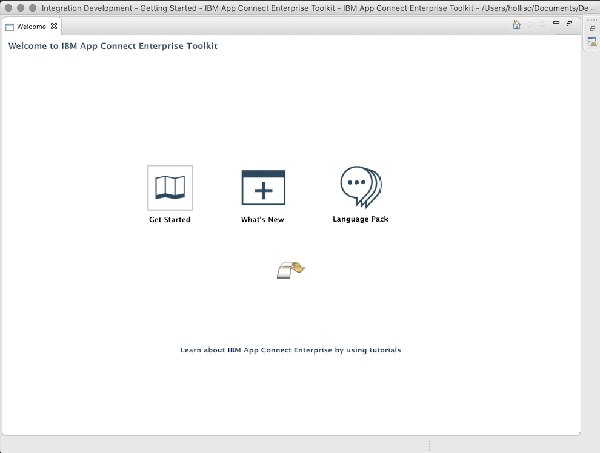
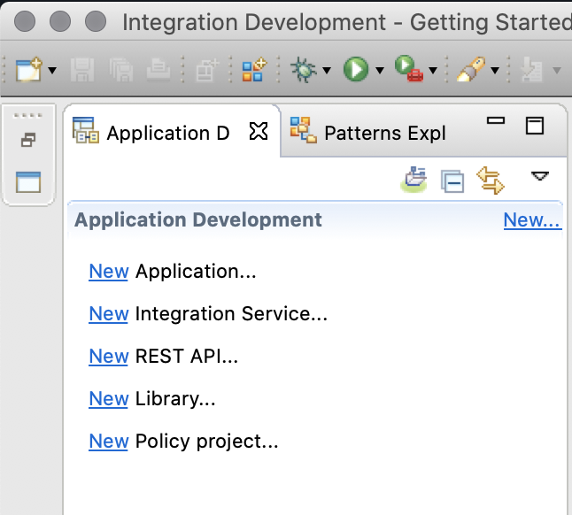
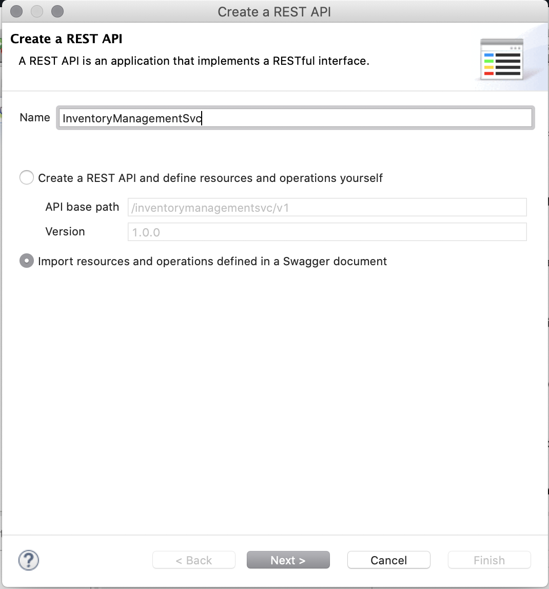
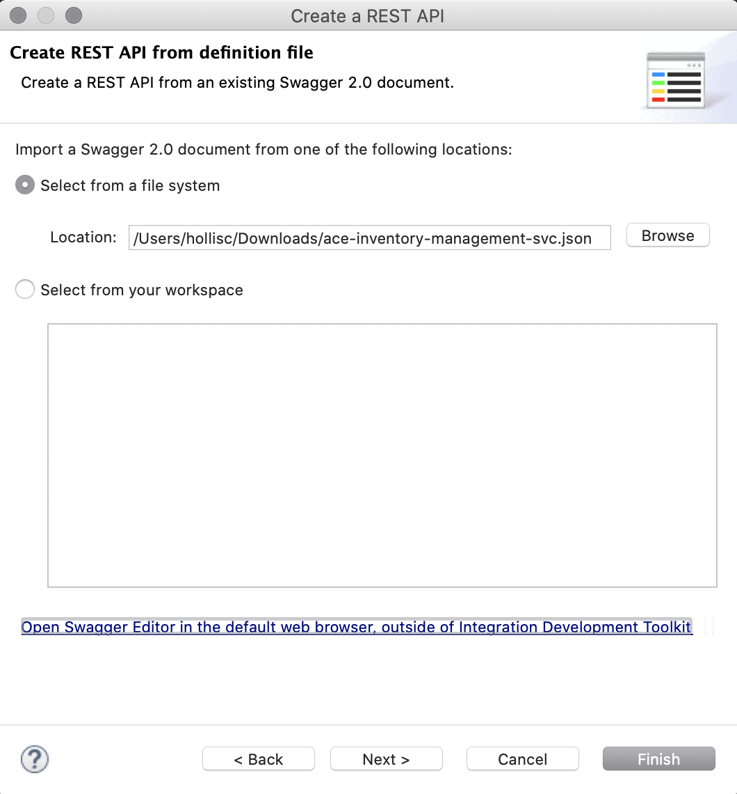
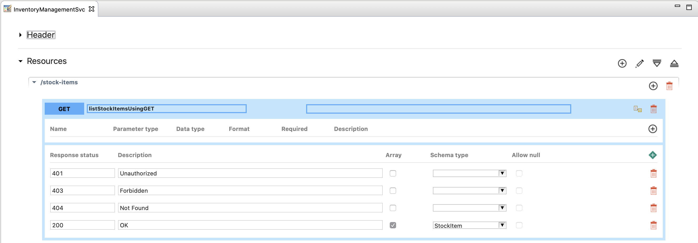
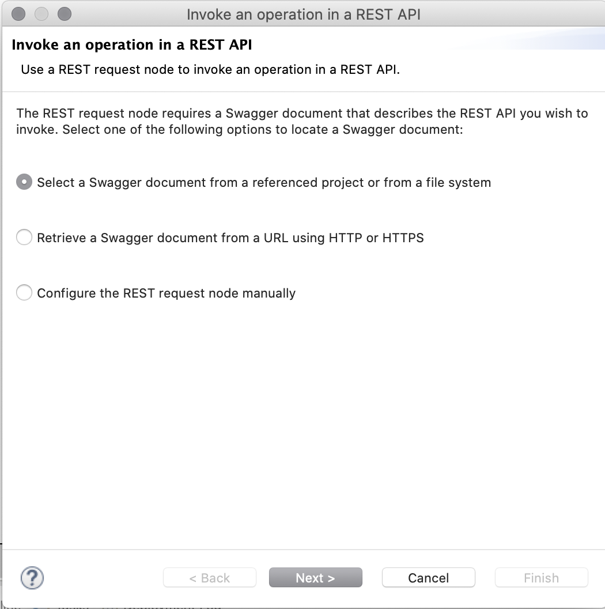
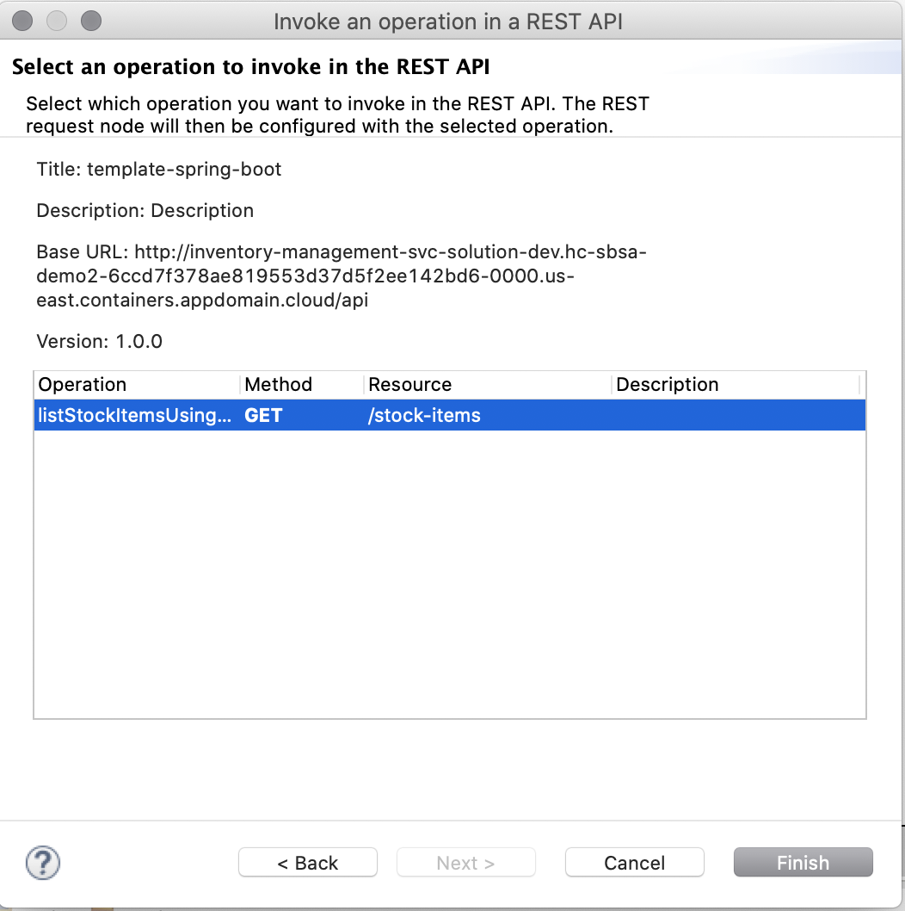
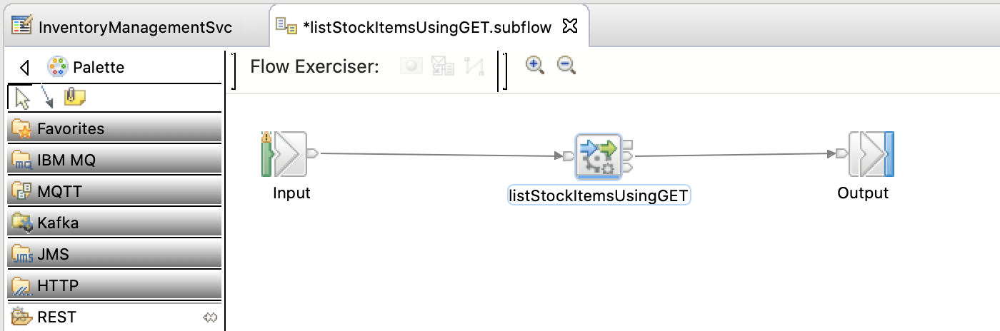

# ACE Toolkit Workspace for managing an Inventory API workflow

This guide provides a walkthrough on how to set up an ACE project to use a REST APi workflow within IBM App Connect Toolkit.  The Github repository is a template containing a Dockerfile and Helm Chart which is used with the [Cloud Native Toolkit](https://cloudnativetoolkit.dev/) to register a Tekton pipeline to build a BAR based on the ACE project and deploy it on a containerized instance of IBM App Connect.  

```
.
├── Dockerfile
├── chart
│   └── base
│       ├── Chart.yaml
│       ├── templates
│       │   ├── NOTES.txt
│       │   ├── _helpers.tpl
│       │   └── integrationserver.yaml
│       └── values.yaml
└── workspace
```

## Pre-requisites
- Deploy the sample Inventory Java Spring microservice to a Kubernetes or OpenShift cluster using the [Cloud Native Toolkit](https://cloudnativetoolkit.dev/).
- Download the [IBM App Connect Toolkit](https://www.ibm.com/support/knowledgecenter/SSTTDS_11.0.0/com.ibm.etools.mft.doc/bb43020_.html).

## Download the Inventory microservice Swagger document
- Browse to the Swagger API Document using the URL provided by the command.
```
echo API Document: $(oc get route inventory-management-svc-solution -o jsonpath='{ .spec.host }' -n dev)/api/v2/api-docs
```
- Select `Raw Data` > `Pretty Print` and `Save`.
- Set the name of the file to `ace-inventory-management-svc.json` and click Save.


## Fork the template "ace-inventory-management-svc" repository
- Fork the repository.
- Clone the repository locally.
```
  git clone git@github.com:hollisc/ace-inventory-management-svc.git
  cd ace-inventory-management-svc
```


## Create a REST API workflow using the ACE Toolkit
- Start the `IBM App Connect Enterprise` toolkit.
- In the Select a workspace window, browse to the `workspace` directory from the cloned Github repository and click OK.

# Create REST API Project
- Minimize the Welcome panel.

- From the `Application Development` panel, click on "New REST API"

- Set the following and click Next.
  - Name: InventoryManagementSvc
  - Select "Import resources and operations defined in a Swagger document"
  
- Choose the `Select from a file system` radio button and browse to the Swagger API Document saved earlier.  Click Finish.


# Create a subflow
- Click on the button to `Open the subflow for the operation`.

- From the Palette, select `REST` > `RESTRequest` and drag it onto the subflow.
- On the `Invoke an operation in a REST API` window,
    - Choose `Select a Swagger document from a referenced project or from a file system`.  Click Next.
    
    - Choose `Select from all referenced projects` and select the `ace-inventory-management-svc.json` file.  Click Next.
    
    - Select `listStockItemsUsingGET` operation.  Click Finish.
    
- Create the connection between `Input` to `listStockItemsUsingGET` and `listStockItemsUsingGET` to `Ouptut`.

- Save your changes.

# Commit changes to the Github repository
```
  git add .
  git commit -am "Add ACE toolkit workspace"
  git push origin main
```
